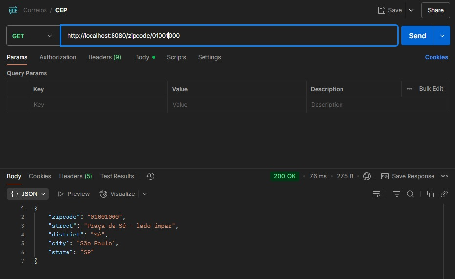
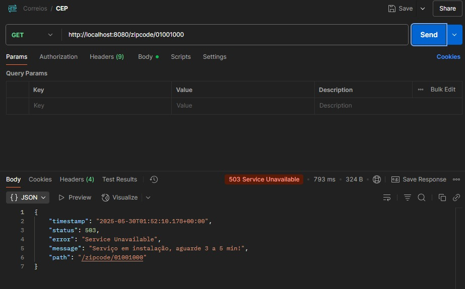

# API-Correios
[](https://github.com/Lucas-iferreira/api-correios/blob/main/LICENSE) 

# Sobre o projeto
Uma API que acessa o [CSV](https://raw.githubusercontent.com/miltonhit/miltonhit/main/public-assets/cep-20190602.csv) que contém 900k de endereços, e os adiciona no banco de dados MySQL, ao subir a aplicação você consegue consultar os endereços pelo CEP via Postman ou qualquer outra ferramenta de testes de API.

# Tecnologias utilizadas
- Java 11
- Spring Boot
- Maven
- Postman
- Mockito 

# Dependencias 
- Spring Web
- Spring Data JPA
- H2
- MySQL
- Lombok

# Como executar o projeto

Pré-requisitos: 
- Java 11
- MySQL

```bash
# clonar repositório
git clone https://github.com/Lucas-iferreira/api-correios.git

# entrar na pasta do projeto pela sua IDE, utilizei o Intellij.

# executar o projeto

# Acessar os Endpoints no Postman -> 
GET CEP -> http://localhost:8080/zipcode/09220608
GET status -> http://localhost:8080/status
```

# Endpoints

- GET CEP 200 -> http://localhost:8080/zipcode/01001000.



- GET CEP 503 -> http://localhost:8080/zipcode/01001000.




# Agradecimentos
Agradeço ao Dev [Milton Bertachini](https://github.com/miltonhit/) pelo projeto realizado separado em 4 partes no [Youtube](https://www.youtube.com/watch?v=6krNblPvWKc&t=226s), que me proporcionou ganhos de conhecimentos notáveis na linguagem e na framework.

# Autor

Lucas Ferreira

https://www.linkedin.com/in/lucas-iferreira/
